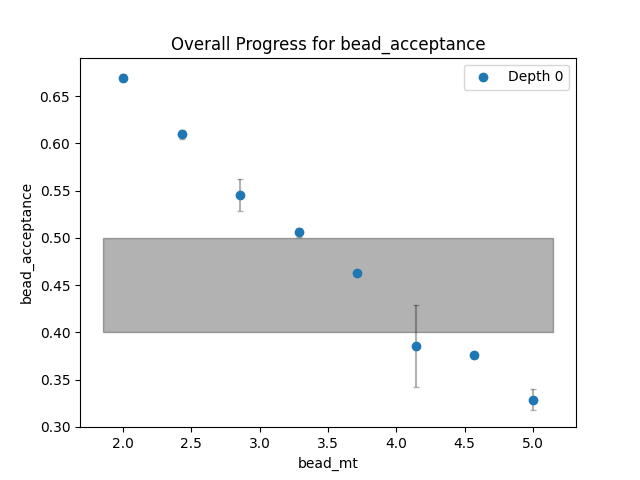
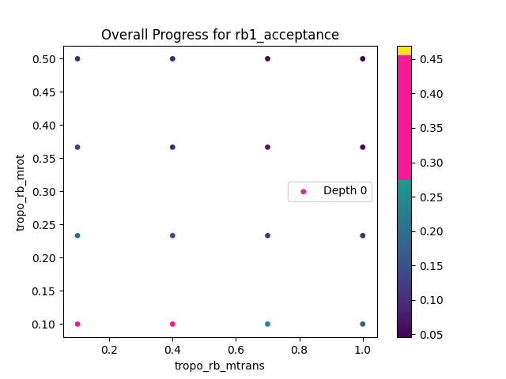
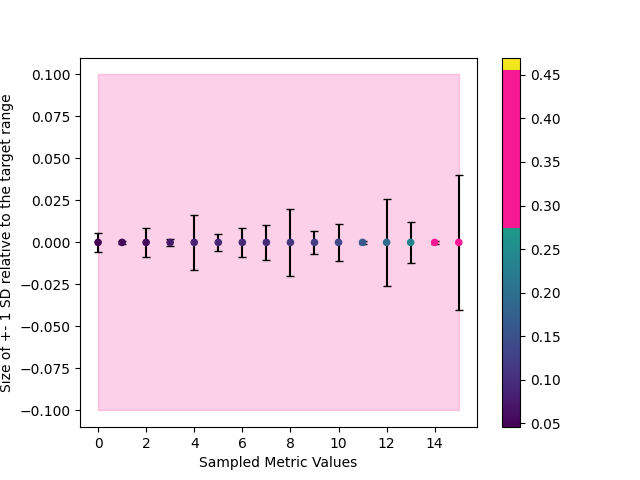
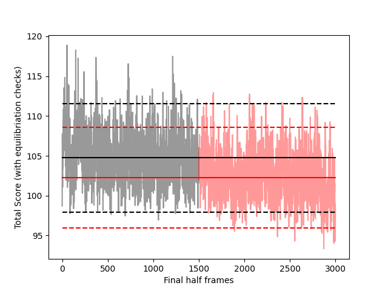
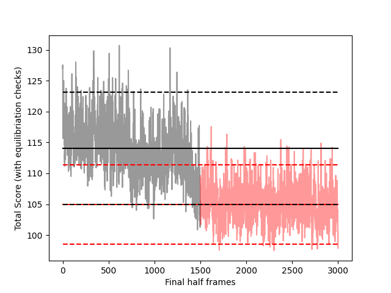

# Basic StOP tutorial for Integrative Modeling on IMP

We shall be using the actin-tropomyosin complex for this tutorial. To begin, first familiarize yourself with the usual IMP workflow, a model script and the basics of IMP modeling. You can have a look at the [actin tutorial](https://integrativemodeling.org/tutorials/actin/) for that.

### Setting the stage
Firstly, we download the scripts and the input data from the [GitHub repository](https://github.com/salilab/actin_tutorial). We primarily need two folders, `data` and `modeling` for this tutorial. Next, make sure you have IMP installed and have installed all the requirements for StOP (`pip install -r requirements.txt`). Finally, copy the four StOP files (`main.py`, `utils.py`, `analyzer.py`, `optimizer.py`) in the folder `modeling` (so that we do not have to keep adding complicated paths to access the files. Otherwise, you can keep these files anywhere you want as long as you modify the paths appropriately). Finally, create a folder called `optimization_data` which stores all the output from StOP.

### Metrics to optimize
We decided to optimize the following three metrics here: `rigid-body MC acceptance ratio for tropomyosin`, `rigid-body MC acceptance ratio for actin-gelsolin`, and `flexible beads MC acceptance ratio`. 

These metrics are usually computed for each frame and available from the IMP stat-files. For each metric, we need to create a regex string which matches all the relevant IMP stat-file fields for that metric. We also need an appropriate target range for each metric. 

1. `rb1_acceptance`: This is the rigid-body MC acceptance ratio for tropomyosin. (regex: `MonteCarlo_Acceptance_P29246`, target-range: `[0.3, 0.5]`)
2. `rb2_acceptance`: This is the rigid-body MC acceptance ratio for actin-gelsolin. (regex: `MonteCarlo_Acceptance_P29248`, target-range: `[0.3, 0.5]`)
3. `bead_acceptance`: This is the flexible beads MC acceptance ratio. (regex: `MonteCarlo_Acceptance_BallMover`, target-range: `[0.4, 0.5]`)

We have kept a tighter target range for flexible beads since it is easier to optimize in comparison to the other two. By default, StOP converts cummulative-acceptance ratios to per-frame acceptance ratios. We can override this behaviour but we currently do not need to do so.

### Parameters that affect the metrics
Next, we specify our five parameters that we will vary to optimize the above metrics. These parameters are variables in the modeling script. 

For each paramter, we list the metrics they affect. We also specify the initial input domain of the parameters (which we have arbitrarily selected here such that the optimization finishes successfully. In practice, you can choose the widest range which is plausible for the modeling setup at hand).

1. `tropo_rb_mtrans`: Maximum translation in A for the tropomyosin rigid body. (metrics affected: `rb1_acceptance`, input domain: `[0.1,1]`)
1. `tropo_rb_mrot`: Maximum rotation in radian for the tropomyosin rigid body. (metrics affected: `rb1_acceptance`, input domain: `[0.1,0.5]`)
1. `actgel_rb_mtrans`: Maximum translation in A for the actin-gelsolin rigid body. (metrics affected: `rb2_acceptance`, input domain: `[0.1,1]`)
1. `actgel_rb_mrot`: Maximum rotation in radian for the actin-gelsolin rigid body. (metrics affected: `rb2_acceptance`, input domain: `[0.1,0.5]`)
1. `bead_mt`: Maximum translation in A for the flexible beads. (metrics affected: `bead_acceptance`, input domain: `[2,5]`)


### Creating the StOP param file
We now need to create the main input file to feed to StOP which contains all the details needed for the optimization run. The format for this file is `<name of the option> : <value of the option>` on different lines for different options. There may be more than one "value" associated to a particular option.

#### Compulsory options
There are some compulsory options. These include specifying the metrics, the parameters and the IMP modeling command to perform the sampling.
We begin by specifying the former two.

```
METRIC : rb1_acceptance : 0.3,0.5 : MonteCarlo_Acceptance_P29246
METRIC : rb2_acceptance : 0.3,0.5 : MonteCarlo_Acceptance_P29248
METRIC : bead_acceptance : 0.4,0.5 : MonteCarlo_Acceptance_BallMover
PARAM : tropo_rb_mtrans : rb1_acceptance : 0.1,1
PARAM : tropo_rb_mrot : rb1_acceptance : 0.1,0.5
PARAM : actgel_rb_mtrans : rb2_acceptance : 0.1,1
PARAM : actgel_rb_mrot : rb2_acceptance : 0.1,0.5
PARAM : bead_mt : bead_acceptance : 2,5
``` 

As you can see, each `METRIC` option takes 3 "values", the name of the metric, the target range (comma separated) and the search string to find the relevant fields under the stat file.
Each `PARAM` option takes 3 "values", the name of the parameter, the metrics affected by the parameter (comma separated) and the input domain (comma separated).

To write the `COMMAND` option, we need to know where IMP is installed on the machine. For the tutorial, let us call that the `IMP_PATH`. We also need the modified IMP script to run. We shall be modifying the `modeling_manual.py` script from the downloaded actin repository, and hence, we will use that script in our command specification.

```
COMMAND : IMP_PATH/setup_environment.sh python -u modeling_manual.py
```
#### Other options
There are several other options that can be specified in the file. Most of them have defaults and are optional. However, it is a good idea to explicitly state them since many of the defaults may not be optimal for the particular machine on which the optimization is being run. For details, read the [README](https://github.com/isblab/stop/blob/main/README.md) on this repository.

The options that we add here will tell StOP to output all the optimization data to a folder called `optimization_data` that we created earlier. We shall use 3 repeats for each parameter combination, and will be running for 5000 frames. The ideal number of frames is such that the run equilibriates in half those many frames. The `m(1)` and `m(2)` values depend on the machine and the expected runtime, but we shall keep this to 8 and 4 respectively. These need to be carefully chosen to maximally utilize the available CPUs.

Have a look at the `param_file` to see the final completed file. There are a lot of optional options that make the progress printing much more informative. It is recommended to specify as many options explicitly as possible.

### Modifying the modeling script
First, we need to modify the modeling script to accept StOP-modified parameters as inputs from the command line. 

StOP feeds the parameters in the same order as they appear on the input options file, followed by an extra entry specifying the output path which needs to be input to the `IMP.pmi.macros.ReplicaExchange0` object as the output directory (it is important since StOP needs to manage where all the data is outputted in order to analyze the correct directories. However, with a custom analysis script, it is possible to use complicated output directory structures too.) 

```python
import sys
tropo_rb_mtrans, tropo_rb_mrot, actgel_rb_mtrans, actgel_rb_mrot, bead_mt = map(float, sys.argv[1:6])
output_path_from_cl = sys.argv[6]
```

Next, we put these parameters wherever we need to specify the corresponding quantities in the modeling script. We also need to set the number of frames (to **5000** in this tutorial) and the output path in the `ReplicaExchange0` macro.  

The modified script is present in the `tutorial` folder along with the original script for comparison (run `diff` on most linux systems to easily compare the two files).

### Running StOP
Next step is to run StOP on our setup. Navigate to the `modeling` folder where we had put the StOP files. Now run `python -u main.py param_file` and wait for StOP to finish. You will see progress bars printed on the terminal depending on the verbosity levels and whether you have specified some options in the input file. This may take a long time to finish, may even be greater than a couple of days based on the `m` that we set. For smaller systems, this would be faster. 

### Looking at the report
StOP outputs a report on successful completion that is stored in `logs` along with a few other plots, logs and other information (number and type of plots depends on the options set in the input file). The report will look something like `report.txt` present in the `tutorial` folder and a part of it is shown below. There is a section for each parameter-group, where you can see if the group was successfully optimized, and the optimized values in that case. There are also a lot of flags displayed here in case something needed attention in the optimization process or if the optimization process failed. Most of the flags here are hopefully self-explanatory and are mentioned in the "Troubleshooting" section below.

```
Parameter Group ID: 2
	Number of parameters: 1
	Number of metrics: 1
	Number of Nodes run: 1
	Maximum Depth: 0
	Optimization Status: Successful
		Successful Node Depth: 0
		Optimal Parameters with corresponding metric values (and sd):
			Param bead_mt: [3.7142856]
			Metric bead_acceptance: 0.462948309178744 (+- 0.0015224522522004234)
```
Overall, the report shows that that all the parameter groups were successful, i.e. all the metrics were successfully optimized. It also give the parameter values for which the metrics were found to lie in the target range, and the corresponding metric values with the standard deviations. Based on the plotting level set, `logs` also contains multiple plots.

### Troubleshooting
In case some of the parameter groups failed to be optimized, StOP outputs several useful ways to troubleshoot the issue. First level is to run StOP at maximum verbosity and notice all the warnings and errors that are printed. At the second level, the plots are useful. For `n < 3`, there are two plots per parameter group. One of them (`<metric_name>_overall_progress.png`) shows the metric-landscape at the candidate points which StOP explored, i.e. the actual values of the metrics that were obtained in the different runs. Two example plots are shown below. In case you notice that all the metric values that you obtained are higher (or lower) than your target range, you can alter the input domain of the parameters accordingly.





Another plot (`<metric_name>_sd_comparison.png`) compares the standard deviation of the metrics across the repeats to the size of the target range. If you notice that the standard deviation across the repeats is higher than (or close to) the target range, one option is to increase the number of repeats. See an example plot below. The ordering of the points on the x-axis is not useful. 



Another important step is to make sure your runs have equilibriated. StOP outputs warning in case it detects non-equilibriated runs, and can also output plots that allow you to get an idea of the total score across the frames. Usually, increasing the number of frames fixes this issue. Note that runs not having equilibriated is a soft-warning in StOP since the results can often be valid despite that. And not all equilibriated runs will be flagged by StOP since the test used is a simple comparison of the means of the penultimate and ultimate quarter of the frames. Shown below are two example plots, the first one is an equilibriated run and the next one is a run that was flagged as being non-equilibriated. You can find these plots in `logs` folder under appropriate subfolders.





Lastly you can also check the flags listed under "issues" section in the report for different parameter groups. These include the following (with suggested mitigations):
1. No iterable ranges at root node -> Change the input domain. If you suspect a complicated landscape, increase the value of `m`
2. No overlapping ranges -> Try increasing `m`. Double check the validity of the metrics affected by each parameter. This could also mean that it is impossible to optimize all the metrics simultaneously. 
3. Maximum depth exceeded -> In most cases, increasing the maximum depth will lead to a successful optimization. However, if the standard deviation of the metrics for each repeat-set of runs (see the plots for the sd comparison) is high, this could be because of a false classification of a range as an iterable range. Increasing the number of repeats here might be helpful.


That's all! We hope you enjoy running StOP! Please let us know if you encounter any problems!
