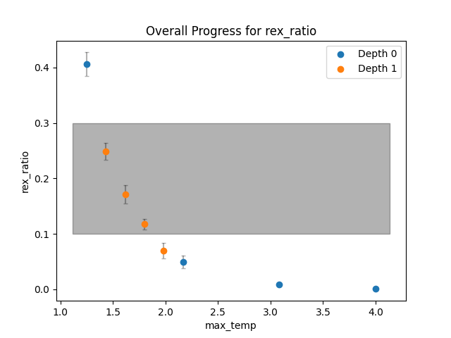
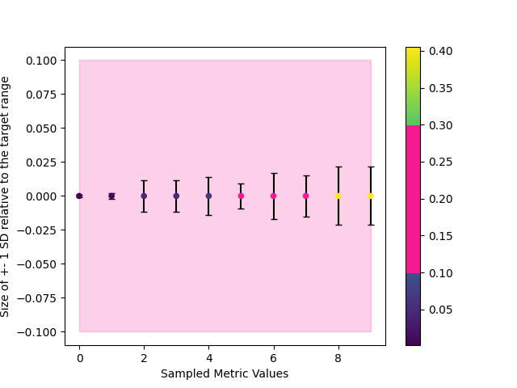

# StOP tutorial for Integrative Modeling on IMP with Replica Exchange

We shall be using the the gtusc-Spc110 complex for this tutorial. To begin, first familiarize yourself with the usual IMP workflow, a model script and the basics of IMP modeling. You can have a look at the [actin tutorial](https://integrativemodeling.org/tutorials/actin/) for that. Next, go through the basic StOP tutorial [here](https://github.com/isblab/stop/blob/main/tutorial/tutorial_basic.md)

### Setting the stage
Firstly, we download the scripts and the input data from the [GitHub repository](https://github.com/integrativemodeling/gtuscSpc110). We primarily need two folders, `inputs` and `script` for this tutorial. Next, make sure you have IMP installed and have installed all the requirements for StOP (`pip install -r requirements.txt`) and also have Open-mpi setup and have loaded the module (to be able to use the `mpirun` command). Finally, copy the four StOP files (`main.py`, `utils.py`, `analyzer.py`, `optimizer.py`) in the folder `scripts/sample` (so that we do not have to keep adding complicated paths to access the files. Otherwise, you can keep these files anywhere you want as long as you modify the paths appropriately). Finally, create a folder called `optimization_data` which stores all the output from StOP.

### Metrics to optimize and the Parameters
For the purposes of the tutorial, we will fix the number of replicas in our modeling setup to 4. We will optimize the following metric here: `Minimum Temperature Replica exchange ratio`, which looks at the exchange ratio of only the minimum temperature replica. (An alternative is to use the exchange ratio computed taking into account all the replica exchanges at all temperatures.) StOP provides a special key to use for this metric called `MinTempReplicaExchangeRatio` and we do not need to create our custom regex search key. (Similarly, you can use `AllTempReplicaExchangeRatio`). We will keep our target range as `[0.1, 0.3]`. The parameter which we alter to optimize the metric is the `max_temp` which is the maximum temperature of the Replica Exchange setup which we add as the `maximum_temperature` argument of the `ReplicaExchange0` macro. We will vary this from 1.25 to 4 (the input domain). The metrics and parameters part of our input option file looks like this:

```
METRIC : rex_ratio : 0.1,0.3 : MinTempReplicaExchangeRatio
PARAM : max_temp : rex_ratio : 1.25,4
```

We will use the monomer script file in the downloaded GitHub repository in the tutorial. The only modifications that we need are changing the number of frames to 5000, reading the `max_temp` and the output path from the command line and setting these two arguments appropriately in the `ReplicaExchange0` macro. See the modified file `new_script.py` in this folder and compare it to the original to look at the changes.

#### Command

Remember to have loaded the `open-mpi` module depending on your usual IMP setup before running StOP. The only modification from the previous tutorial is to add the `mpirun` bit in the command. The modified file that contains the 

```
COMMAND : IMP_PATH/setup_environment.sh mpirun -np 4 python -u new_script.py
```
#### Other options
This time, some of the other options have to be chosen carefully. The `max_np` parameter runs these many parallel StOP runs, but in our case, each of these runs contains 4 replicas (and hence needs 4 cores). We can either scale down this parameter based on this knowledge or set `n_per_command` to 4 (the latter being the preferred approach). Another important option to consider here is the `cleanup` option since the runs can generate a large amount of data and there is no safety mechanism to check if enough space is available. The complete options files is called `param_file_replica` in the folder.

### Running StOP
Next step is to run StOP on our setup as previously described and wait for StOP to do its work!

### Looking at the report
In our case, (see `report_replica.txt` in the folder) we manage to successfully optimize this metric and all the other checks (equilibriation, sd-comparison to the target range) are satisfactorily settled. Below are the overall progress and the sd-comparison plots for this optimization.






That's all folks!
